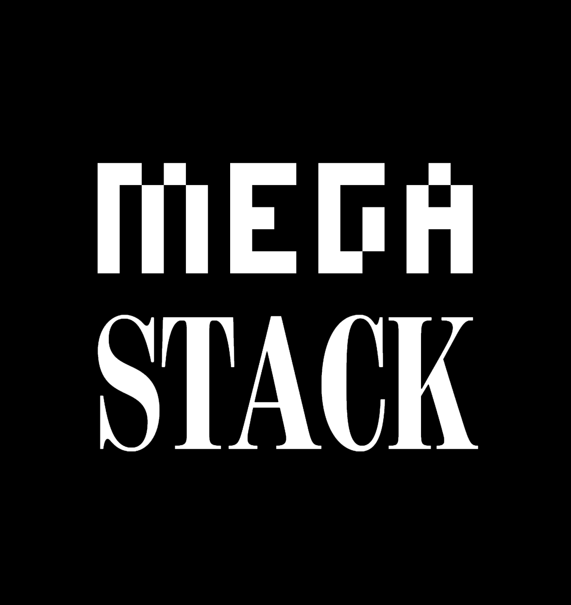

<p align="center">
  <a href="#readme"><picture>
    <source media="(prefers-color-scheme: dark)" srcset="./assets/logo-dark.png" />
    <source media="(prefers-color-scheme: light)" srcset="./assets/logo-light.png" />
    
  </picture></a>
</p>

<br/>

<!--OVERVIEW-->

Megastack is a React-based web frontend bootstrapper that provides tools for routing, data fetching, task execution,
form state management, validation, localization and internationalization out of the box.

Applications built with Megastack support both streaming SSR and standalone CSR simultaneously and can be deployed in
any environment. Every part of Megastack is designed to be as performant and memory-optimized as possible, while
offering concise, expressive APIs and an excellent developer experience.

<!--/OVERVIEW-->

```bash
npx megastack init
```
